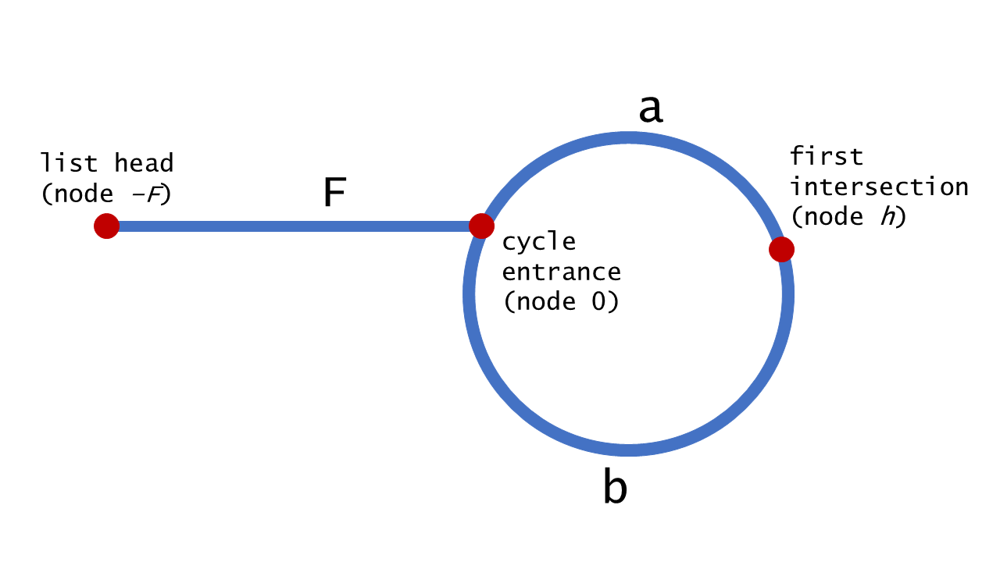
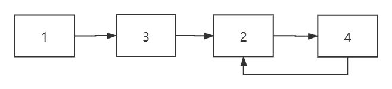
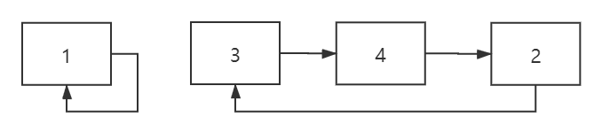

# 链表专题

## 链表成环问题

问题描述：如果判断链表是否成环？

进阶问题：如果找出该环的入口，本问题对应力扣141、142俩道题

<https://leetcode-cn.com/problems/linked-list-cycle-ii/> 

 <https://leetcode-cn.com/problems/linked-list-cycle/> 

### 基础问题解答

判断链表成环的思路非常简单，只需要用快慢指针就可以实现，想象你在操场跑步，一人跑的快，一人跑的慢，是不是总是会相遇，为什么，因为操场是圆的，只要你的速度一直是快的，总会存在 Sa-Sb=nL（Sa是快男[ps:没有开车哈]的路程，Sb是慢男的距离，L是圆的距离）

那么当你要用程序表示的时候就需要考虑用什么来制造一个快一个慢？这里不懂的同学要思考几分钟，想想如何表示快慢。

主流的快慢的指针做法是fast指针一次走俩步，slow指针一次走一步，通过这样来实现一个块，一个慢，而这种做法也为或许找环的入口提供了便利的方法。

```c++
/**
 * Definition for singly-linked list.
 * struct ListNode {
 *     int val;
 *     ListNode *next;
 *     ListNode(int x) : val(x), next(NULL) {}
 * };
 */
class Solution {
public:
    bool hasCycle(ListNode *head) {
        if(head==NULL)
            return false;
        ListNode *slow,*fast;
        slow=fast=head;
        while(fast && fast->next){
            //fast一次走俩步
            fast=fast->next->next;
            slow=slow->next;
            if(slow==fast)
                return true;
        }    
        return false;
    }
};
```


### 进阶问题

​	如何找到环的入口，这里就要摆上一些数据公式了，首先，先盗用一下力扣官方题解的图(懒得画图)



假设相遇在 first intersetion所标注的点，那么其到环入口的距离就是a

有以下公式：（S1：快指针的路程，S2：慢指针的路程，L：环的长度）

当在距离入口a处相遇时，有以下公式：

S1-S2=nL（n表示任意常数，这个应该都能看懂）

S1=k1L+F+a

S2=k2L+F+a

这里看上去似乎没有什么关联，但是请你注意，这里隐含一个条件，快慢指针的距离差是2倍，每次快指针都是走俩步，慢指针走一步，所以相差是俩倍。

S1=2S2

由 S1-S2=nL,  S1=2S2  可以推出   S2=nL

由 S2=k2L+F+a   以及S2=nL  可以推出  F=(n-K2)L-a

其中(n-K2）L可以再化解为，(n-K2-1)L+L

所以F=(n-K2-1)L+(L-a)   **F=(n-K2-1)L+b**  到这一步答案就已经推出来了，还没理解的同学再好好想想。

其实就是说当你走完b这段路程，再走(n-K2-1)圈就可以到达入口处了，那么可能有些同学会纠结说那我哪知道(n-k2-1)是多少呀，其实呢(n-K2-1)相当于0，因为首次相遇时，S1还没能走完一圈就会相遇，所以得出F=b

```C++
/**
 * Definition for singly-linked list.
 * struct ListNode {
 *     int val;
 *     ListNode *next;
 *     ListNode(int x) : val(x), next(NULL) {}
 * };
 */
class Solution {
public:
    ListNode *detectCycle(ListNode *head) {
        ListNode * pSlow=head;
        ListNode * pFast=head;
        while(pFast!=NULL&&pFast->next!=NULL)
        {
            pSlow=pSlow->next;
            pFast=pFast->next->next;
            if(pFast==pSlow)
            {
                pFast=head;
                while(pSlow!=pFast)
                {
                    pSlow=pSlow->next;
                    pFast=pFast->next;
                }
                return pFast;
            }
              
        }

        return NULL;
    }
};

```

### 扩展问题

力扣287题，寻找重复数

给定一个包含 n + 1 个整数的数组 nums，其数字都在 1 到 n 之间（包括 1 和 n），可知至少存在一个重复的整数。假设只有一个重复的整数，找出这个重复的数。

示例 1:

输入: [1,3,4,2,2]
输出: 2
示例 2:

输入: [3,1,3,4,2]
输出: 3
说明：

不能更改原数组（假设数组是只读的）。
只能使用额外的 O(1) 的空间。
时间复杂度小于 O(n2) 。
数组中只有一个重复的数字，但它可能不止重复出现一次。

来源：力扣（LeetCode）
链接：https://leetcode-cn.com/problems/find-the-duplicate-number

这题可以用快慢指针做法，相信是很多人没能考虑到的

这里可以试着把每个元素都当作一个链表的结点，然后进行链接，以题目的俩个例子作为示例子

一开始slow下标为0，那么slow=nums[slow]=1,然后取下标为1的值3，slow=3,然后再取下标为3的值，slow=2再取下标为2的值，slow=4,再取下标为4的值，slow=2，绕回到原来2的过程。



数组链表只存在俩种情况，要么自己成环，例如1,要么跟别的元素成环



```c++
class Solution {
  
public:
    int findDuplicate(vector<int>& nums) {
        int fast,slow;
        fast=slow=0;
        do{
            slow=nums[slow];
            //fast 走俩步
            fast=nums[nums[fast]];
        }while(fast!=slow);
        slow=0;
        //按照前文找环入口的分析进行分析
        while(slow!=fast){
            slow=nums[slow];
            fast=nums[fast];
        }
        return fast;
    }
};
```

## 链表交叉问题

判断俩个链表是否存在相交，不需要找到交点。要求：时间复杂度越小越好，空间复杂度越小越好，这是我面试字节跳动抖音部门所遇到的算法题，当时只答出了俩种思路，后面扩展了一些思路，如果有更好的解法，请大神留言。

### 解法一

使用栈，通过俩个栈保存俩个链表的每个元素，然后再输出栈的内容，相当于就是逆序输出链表，好处就是可以找到交点，只要俩个链表存在相交，那么其栈顶一定是相同的，一直出栈，直到遇到不相同的，说明开始分叉，那么相交点就是分叉前的一个相同的节点。

好处：可以找到相交点，时间复杂度O（N）

坏处：需要栈这个空间

当时面试官就诟病这种做法

### 解法二

先找出俩个链表的长度，然后长的链表先走k(俩个链表长度之差)步，然后判断是否存在相同节点

### 解法三

直接判断俩个链表的最后一个元素是否相同，只要相交，最后一个元素一定相同

## 链表逆置

这道题也是面试常见题，没什么好说的，看到这道题就直接撸，2019年阿里云校招面试题之一。

[面试题24. 反转链表](https://leetcode-cn.com/problems/fan-zhuan-lian-biao-lcof/)

难度简单42

定义一个函数，输入一个链表的头节点，反转该链表并输出反转后链表的头节点。

**示例:**

```
输入: 1->2->3->4->5->NULL
输出: 5->4->3->2->1->NULL
```

```c++
/**
 * Definition for singly-linked list.
 * struct ListNode {
 *     int val;
 *     ListNode *next;
 *     ListNode(int x) : val(x), next(NULL) {}
 * };
 */
class Solution {
public:
    ListNode* reverseList(ListNode* head) {
        if(head==NULL)
            return NULL;
        ListNode * rever(head),*old(head->next),*temp(head),*pre;
        rever->next=NULL;
        while(old){
            pre=old->next;
            old->next=temp;
            temp=old;
            old=pre;
        }
        return temp;
    }
};
```

